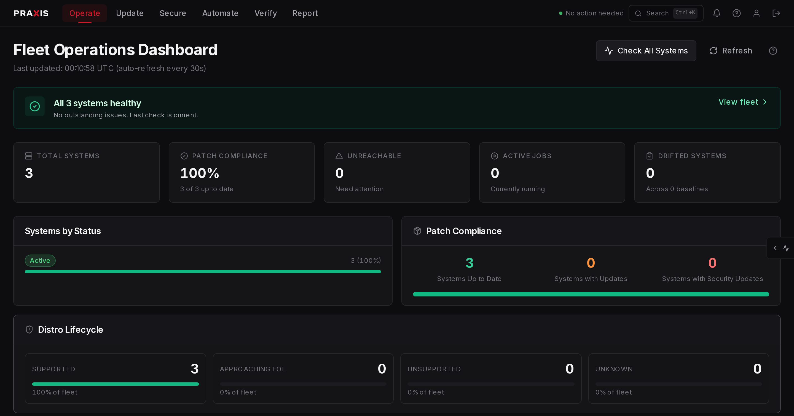
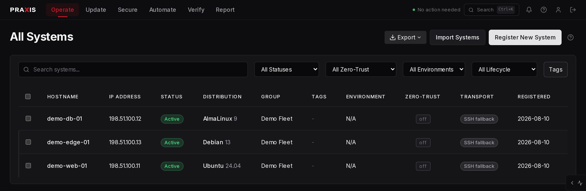
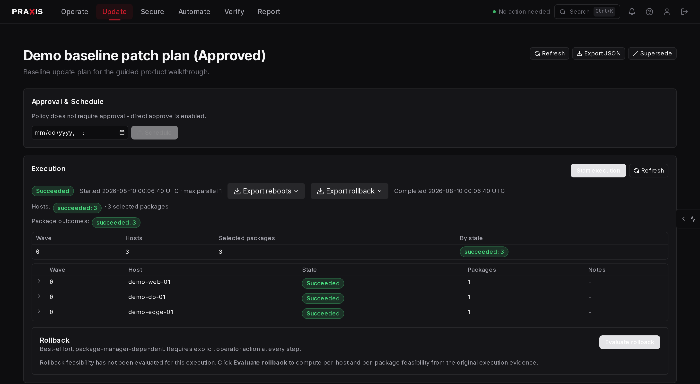
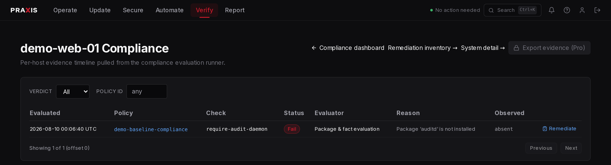
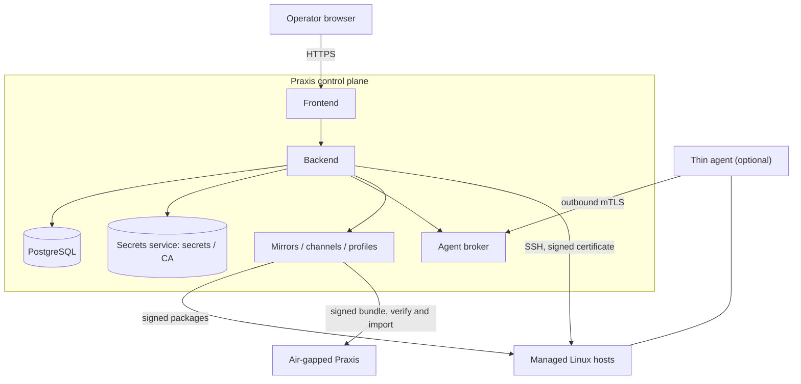

# Praxis

[](https://github.com/cytechlabs/praxis/actions/workflows/ci.yml)
[](LICENSE)

**Praxis is a self-hosted Linux fleet lifecycle control plane.** One backend
stays the policy authority for a fleet of Linux hosts, from enrollment and
inventory through package and content, patching, compliance evidence, and
remediation. It manages hosts over SSH. An optional thin agent adds a limited
outbound path for command execution, file transfer, and facts on hosts that
cannot accept inbound connections; package, repository, drift, health,
provisioning, and browser terminal work stays on SSH.

Documentation: **[docs.praxisfleet.com](https://docs.praxisfleet.com)**. The same
pages ship inside the application at `/help`, so an installed Praxis carries its
own documentation offline.

## What it manages

- **Hosts and facts** - enrollment, inventory, distribution, kernel, uptime,
  reboot state, end-of-life status, and fleet grouping.
- **Access and audit** - fleet-scoped roles, just-in-time access requests and
  approvals, interactive SSH sessions, command approvals and history, file
  transfer, and session recording, all audited.
- **Packages and content** - package inventory and updates, repository mirrors,
  signed channels and content profiles, and air-gapped export and import.
- **Patch lifecycle** - patch policies and rollout rings modeled separately from
  update plans and executions, with approvals, reboot control, and rollback.
- **Compliance and remediation** - compliance policies, per-host evidence, and a
  governed, approval-gated remediation workflow.
- **Operational reporting** - package reports, fleet operations history,
  activity, analytics, and configuration audit.

Praxis produces compliance evidence rather than certification, and it is
deliberately scoped. [Known limitations](docs/known-limitations.md) states what
it does not do, so you can plan complementary controls.

## What it looks like









## How Praxis reaches a host

**SSH is the default and the complete transport.** The control plane opens a
session using a stored credential, and it is what interactive terminal sessions
always use.

**The thin agent is optional.** It is a single static Go binary that dials
**out** to the broker over mutually authenticated TLS, so it suits hosts behind
NAT or a firewall that cannot accept inbound connections. Its identity is minted
by the backend, not asserted by the host.

The two are **not equivalent**. The agent tunnel carries command execution, file
get and put, and facts collection. Package inventory and changes, repository
management, baselines and drift, health checks, directory browsing, fleet user
provisioning, and the browser terminal run over SSH regardless of a host's
transport preference. [Transports](docs/transports.md) is the decision, and the
[agent and SSH capability matrix](docs/agent-capability-matrix.md) is the
authoritative per-operation breakdown.

## Install

Praxis runs as a Docker Compose stack on a single Linux host. Check
[requirements](docs/requirements.md) first; most failed installs are a missing
prerequisite.

The images are published to a container registry; the Compose files and the
environment template come from this repository:

```sh
git clone https://github.com/cytechlabs/praxis.git
cd praxis

# The release you intend to run. Checking the tag out keeps the
# Compose files in step with the images it will pull.
export PRAXIS_VERSION=1.0.0
git checkout "v$PRAXIS_VERSION"

cp .env.example .env
```

Three values must be set in `.env` before a fresh install will start:
`SECRET_KEY`, `ADMIN_PASSWORD`, and `POSTGRES_PASSWORD`. Startup fails closed on
a weak signing key, on an empty administrator password while the database has no
users, and on the retired default database password.

The rest carry defaults aimed at local evaluation, and are the choices a real
deployment makes deliberately: `PRAXIS_DOMAIN` (defaults to `localhost`),
`PRAXIS_TLS_MODE` (defaults to `internal`, a self-signed Caddy certificate),
`PUBLIC_BASE_URL` (defaults to `https://localhost`), and `PRAXIS_VERSION`, which
selects the image tag and falls back to `latest` when unset. Put the release you
verified in `.env` rather than tracking a moving tag. Then pull the images and
start the stack:

```sh
docker compose -f docker-compose.yml -f docker-compose.prod.yml \
    --profile bundled --profile proxy pull

docker compose -f docker-compose.yml -f docker-compose.prod.yml \
    --profile bundled --profile proxy up -d
```

`--profile bundled` runs PostgreSQL and the OpenBao secrets service inside the
stack, which is the supported single-node shape. `--profile proxy` starts Caddy,
the only browser ingress: the backend and frontend publish no host ports, so
without it the stack is deliberately unreachable from a browser. Omit it only
when you front the stack with your own reverse proxy.

Continue with [install](docs/install.md), then [first run](docs/first-run.md) and
[enroll hosts](docs/enroll-hosts.md). To build from source instead of pulling,
add `--build`; that is the contributor path rather than the evaluator one.

### Verify what you are about to run

Releases publish two container images, `ghcr.io/cytechlabs/praxis-backend` and
`ghcr.io/cytechlabs/praxis-frontend`, plus the fleet agent as signed tarballs
under a matching `agent-vX.Y.Z` tag. Each release attaches a CycloneDX SBOM per
image, the agent checksums and their signature, and `release-index.json`
recording the source commit and every component digest.

Signing is keyless through GitHub OIDC attestations, so there is no public key to
distribute:

```sh
gh attestation verify \
    oci://ghcr.io/cytechlabs/praxis-backend@sha256:<digest> \
    --repo cytechlabs/praxis
```

Deploy digests rather than tags: `X.Y.Z` is not repointed once published, but
`X.Y` and `latest` both move.
[Verify release artifacts](docs/verify-release-artifacts.md) covers image, SBOM,
and agent tarball verification, and a failed check is a stop rather than a
warning.

## Supported boundary

The control plane needs Docker Engine 24.0 or newer and Compose v2.24 or newer on
a Linux host, `amd64` or `arm64`. The web console targets a desktop viewport of
1280px or wider.

For the **managed fleet**, the complete patch lifecycle is supported on the deb
family (Debian, Ubuntu) and the EL family (RHEL, Rocky, AlmaLinux). Other
distributions may enroll and report inventory on a best-effort basis without
being serviceable for package changes. The
[Linux support matrix](docs/support-matrix.md) is authoritative, including the
per-capability validation grid and known distro-specific limitations.

The supported production topology runs a **single backend worker**. Interactive
session state is held in the process that opened the session, so the production
entrypoint refuses to start with more than one worker.

See [requirements](docs/requirements.md),
[production hardening](docs/production-hardening.md),
[upgrade](docs/upgrade.md), [backup and restore](docs/backup-restore.md), and
[airgap export and import](docs/airgap.md).

## Architecture and trust

The backend is the single policy authority. The browser talks only to the
frontend, the frontend proxies to the backend, and only the backend reaches the
data tier, the agent broker, and the mirror subsystem.



PostgreSQL holds metadata, audit, and lifecycle records. Secret and PKI material
lives in OpenBao, a Vault-compatible secrets service bundled for single-node
deployments; an external OpenBao or HashiCorp Vault cluster is also supported.
The database and secrets service have no route to the frontend. Mirrors serve
signed package content and can export a signed bundle that a disconnected Praxis
verifies and imports.

[Security model and trust boundaries](docs/security-model.md) states what each
component is trusted to do. Report vulnerabilities privately through
[SECURITY.md](SECURITY.md) rather than a public issue.

## Free and paid

Praxis is **open core**, and everything in this repository is the open-source
core under Apache 2.0.

The free edition is a complete, self-hostable control plane for up to **15
managed hosts**, with unlimited users, single sign-on, and the full fleet,
patch, content, and compliance surfaces. What ships free in 1.0 is intended to
stay free. A paid licence lifts the host cap and unlocks a set of governance
controls; paid API actions return HTTP 402 without the entitlement, and the
interface shows those controls as locked.

Activation is **offline-first**. A licence is a signed token bound to a
deployment's installation ID and verified locally against a public key built
into official images, so applying one needs no activation server and no network
reachability. **The free edition needs no licence at all, and neither it nor
offline activation calls home or sends telemetry.** There is also no separate
paid image and no private registry to authenticate against: one stock install
runs free and unlocks in place when a valid licence is applied. Hosts you
already manage are never disabled for being over cap.

A connected paid install can additionally refresh a licence it already holds as
expiry approaches, so the term advances without anyone pasting a new key. That
path is optional and best-effort: it does nothing unless a renewal credential
has been stored, it is attempted only near expiry rather than on every start,
and an install that cannot reach it keeps running on the licence it holds. It
never gates a running deployment and is not needed for air-gapped operation.
The service behind it arrives with the purchase flow.

**Self-serve purchasing is not open yet.** The tiers, entitlements, and host
caps are settled, and the deployment side of activation (validate a licence,
apply it, report status) is implemented; the checkout and licence-issuing
service is part of the remaining launch work.

[Editions and feature tiers](docs/editions.md) draws the line;
[licensing and activation](docs/licensing.md) covers the mechanics.

## Documentation

Start at [docs.praxisfleet.com](https://docs.praxisfleet.com), or read the same
pages in [`docs/`](docs/README.md).

| Area | Pages |
|---|---|
| Getting started | [requirements](docs/requirements.md) - [install](docs/install.md) - [first run](docs/first-run.md) - [enroll hosts](docs/enroll-hosts.md) - [a tour of the interface](docs/getting-started.md) |
| The model | [fleet lifecycle architecture](docs/fleet-lifecycle-architecture.md) - [security model](docs/security-model.md) - [transports](docs/transports.md) - [editions](docs/editions.md) |
| Operations | [production hardening](docs/production-hardening.md) - [upgrade](docs/upgrade.md) - [backup and restore](docs/backup-restore.md) - [airgap](docs/airgap.md) - [single sign-on](docs/oidc-setup.md) |
| Release and trust | [verify release artifacts](docs/verify-release-artifacts.md) - [compliance evidence map](docs/compliance-map.md) - [known limitations](docs/known-limitations.md) |
| When something is wrong | [troubleshooting](docs/troubleshooting.md) - [support](docs/support.md) |

## Contributing

Contributions are welcome. [CONTRIBUTING.md](CONTRIBUTING.md) covers the branch
model, the local checks, and the sign-off requirement: Praxis uses the
[Developer Certificate of Origin](https://developercertificate.org/) rather than
a CLA, so every commit carries a `Signed-off-by` trailer (`git commit -s`). It is
enforced automatically on pull requests. By participating you agree to the
[Code of Conduct](CODE_OF_CONDUCT.md).

The checks that mirror CI:

```sh
# Backend, from backend/ in a virtualenv (see backend/tests/README.md)
black . && isort --profile black --settings-path setup.cfg .
pylint app
pytest

# Frontend, from frontend-next/
npm run lint
npm run check:colors
npx tsc --noEmit
npm test

# Agent, from agent/
gofmt -l .   # prints nothing when clean
go vet ./...
go test ./...
```

The documentation site builds from `docs/`; see
[docs-site/README.md](docs-site/README.md) for how to add a page and regenerate
the copy bundled into the application. Operator-facing agent install, update, and
rollback steps live in [agent/packaging/README.md](agent/packaging/README.md).

## License

The public core in this repository is licensed under the
[Apache License 2.0](LICENSE); see also [NOTICE](NOTICE). Optional paid
extensions are not part of this repository and are distributed separately under
their own commercial terms.
