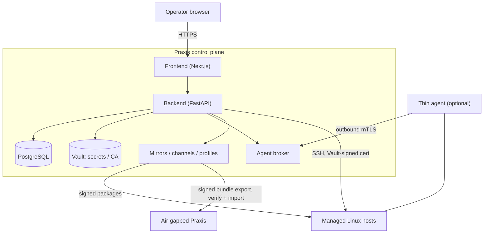

# Praxis

Praxis is a self-hosted **Linux fleet lifecycle control plane**. From one backend that stays the policy authority, it owns the lifecycle of a Linux fleet: host enrollment and inventory, access and audit, package and content, patching, compliance evidence, and remediation. It connects to managed hosts over SSH by default (with short-lived certificates signed by the bundled OpenBao secrets service), and managed environments can optionally add a thin agent that dials out over mTLS. Secrets and PKI material live in OpenBao — a Vault-compatible secrets service bundled for 1.0; an external OpenBao/HashiCorp Vault cluster is also supported — and everything is driven from a web UI.

Praxis manages:

- **Hosts & facts**: enrollment, inventory, distribution/kernel/uptime/reboot/EOL facts, and fleet grouping.
- **Access & audit**: fleet-scoped RBAC, just-in-time access requests and approvals, interactive SSH sessions, command approvals and history, file transfer, and session recording, all audited.
- **Packages & content**: package inventory and updates, repository mirrors, signed channels and content profiles, and air-gapped export/import.
- **Patch lifecycle**: patch policies and rings (rollout policy) modeled separately from update plans and executions, with approvals, reboot control, and rollback.
- **Compliance & remediation**: compliance policies and per-host evidence, plus a governed, approval-gated remediation workflow.
- **Operational reporting**: package reports, fleet operations history, activity, analytics, and configuration audit.

For the full picture, see the [public documentation](docs/README.md), including [what Praxis does and does not manage](docs/README.md#what-praxis-manages), the [security model and trust boundaries](docs/security-model.md), and [known limitations](docs/known-limitations.md).

---

## Quick Start

```bash
git clone https://github.com/cytechlabs/praxis.git
cd praxis
cp .env.example .env
```

Open `.env` and set the two required values:

```
SECRET_KEY=<secure random string, min 32 chars>
ADMIN_PASSWORD=<initial admin password>
```

Then build and start the stack (`--profile proxy` starts Caddy, the browser ingress — see the Access table below and [Deployment](#production-deployment)):

```bash
docker compose -f docker-compose.yml -f docker-compose.prod.yml --profile bundled --profile proxy up -d --build
```

The bundled profile starts PostgreSQL, Vault, and a backup service in-stack. See [Deployment](#production-deployment) to use external services or pull pre-built images instead.

**Access** (started with `--profile proxy`):

| Service | URL |
|---|---|
| Web UI (Caddy ingress) | https://localhost |
| Prometheus UI | http://localhost:9091 (loopback only) |

Backend and frontend publish no direct host ports; Caddy is the sole browser
ingress.

The bundled **Prometheus** (`prom/prometheus:v3.13.1`, loopback-only UI on
`127.0.0.1:9091`) is infrastructure telemetry for the control plane: it scrapes the
backend exporter at `backend:9090` and persists its TSDB to the named volume
`praxis_prometheus_data` (survives container recreation; ~15-day retention). It is
**not** the paid Command Metrics feature, and 1.0 ships no Grafana, Alertmanager,
extra exporters, or public metrics ingress. See
[database-connection-pooling.md](backend/docs/database-connection-pooling.md#bundled-prometheus-infrastructure-telemetry--pra-300). The API is served through the web origin at `https://localhost/api/backend/...`.
Interactive API docs are disabled when `ENVIRONMENT=production` (the default) — see
[API Docs](#api-docs).

---

## Architecture

The backend is the single policy authority. The browser talks only to the frontend; the frontend proxies to the backend; and only the backend reaches the data tier, the agent broker, and the mirror subsystem.



If the diagram does not render: the **browser** reaches the **frontend**, which proxies to the **backend**; the backend is the only tier that reaches **PostgreSQL** (metadata, audit, lifecycle records), **Vault** (secrets, CA/PKI), the **agent broker**, and the **mirror** subsystem. **Managed hosts** are reached over **SSH by default** or, optionally per host, via a **thin agent** that dials **out** to the broker over mTLS. **Mirrors** serve signed package content and can export a **signed airgap bundle** that a disconnected Praxis instance verifies and imports.

**Deployment / network model (bundled mode):**

```
Browser
  └── frontend (Next.js, :3000)
        └── backend (FastAPI, :8000)
              ├── db (PostgreSQL, bundled)
              ├── vault (OpenBao, bundled secrets runtime)
              └── prometheus (metrics scraper)
```

`frontend_net` connects the browser-facing frontend to the backend. `backend_net` connects the backend to the data tier (PostgreSQL, Vault, Prometheus). The database and Vault have no route to the frontend — the backend is the sole ingress path to the data tier.

In bundled mode, Vault and PostgreSQL run as sidecar containers. In external mode, operators point `DATABASE_URL` and `VAULT_ADDR` at their own infrastructure.

For tiers, trust boundaries, and what each component is trusted to do, see the [Security Model](docs/security-model.md).

---

## Environment Variables

### Required

| Variable | Description |
|---|---|
| `SECRET_KEY` | JWT signing key — secure random string, min 32 chars |
| `ADMIN_PASSWORD` | Password for the `admin` account created on first run |

### Deployment Mode

| Variable | Default | Description |
|---|---|---|
| `COMPOSE_PROFILES` | `bundled` | Set to `bundled` to run Postgres + Vault in-stack. Remove or leave blank to use external services. |

### Database

| Variable | Default | Description |
|---|---|---|
| `POSTGRES_USER` | `postgres` | Database username (bundled mode) |
| `POSTGRES_PASSWORD` | `postgres` | Database password (bundled mode) |
| `POSTGRES_DB` | `praxis` | Database name (bundled mode) |
| `DATABASE_URL` | _(built from above)_ | Full DSN — set this to override in external mode |
| `TEST_DATABASE_URL` | _(built from above)_ | DSN for the test database |

### Vault

| Variable | Default | Description |
|---|---|---|
| `VAULT_ADDR` | `http://vault:8200` | Vault URL. In bundled mode this resolves to the in-stack container. |
| `VAULT_TOKEN` | _(read from shared volume)_ | Required in external mode. In bundled mode the backend reads the token from the shared `vault_data` volume. |

### Auth

| Variable | Default | Description |
|---|---|---|
| `ALGORITHM` | `HS256` | JWT signing algorithm |
| `ACCESS_TOKEN_EXPIRE_MINUTES` | `30` | Access token lifetime |
| `REFRESH_TOKEN_EXPIRE_DAYS` | `7` | Refresh token lifetime (rolling rotation) |
| `ADMIN_USERNAME` | `praxisadmin` | Bootstrap admin username created on first run (maps to a managed Linux login for per-user fleet access, so it avoids the common `admin` host collision; the in-app Administrator role is unaffected) |
| `ADMIN_EMAIL` | `admin@praxis.dev` | Admin email created on first run |

### CORS / Trusted Hosts

| Variable | Default | Description |
|---|---|---|
| `CORS_ORIGINS` | `https://localhost,http://frontend:3000` | Comma-separated allowed origins (set to your real browser origin in production) |
| `TRUSTED_HOSTS` | `localhost,127.0.0.1,backend` | Comma-separated trusted host headers |

---

## Development

Praxis has a single production-parity local workflow: the base stack
builds the production images/entrypoints, and `docker-compose.prod.yml` layers on
the release hardening. There is no separate dev image, source bind mount, hot
reload, or `make` wrapper. `--profile proxy` starts Caddy, which is the only
browser ingress — without it the stack runs but publishes no app host ports and
is unreachable from a browser.

### Run the stack (from current source)

```bash
# build + start (browser: https://localhost via Caddy)
docker compose -f docker-compose.yml -f docker-compose.prod.yml --profile bundled --profile proxy up -d --build

# tail logs
docker compose -f docker-compose.yml -f docker-compose.prod.yml --profile bundled --profile proxy logs -f

# stop
docker compose -f docker-compose.yml -f docker-compose.prod.yml --profile bundled --profile proxy down

# full reset (destroys volumes)
docker compose -f docker-compose.yml -f docker-compose.prod.yml --profile bundled --profile proxy down -v
```

### Common operator commands

| Task | Command |
|---|---|
| Run DB migrations | `docker compose exec backend alembic upgrade head` |
| Roll back last migration | `docker compose exec backend alembic downgrade -1` |
| Vault root token | `docker compose exec vault cat /vault/recovery/root-token` |
| Vault backend token | `docker compose exec vault cat /vault/data/backend-token` |
| Trigger a manual DB backup | `docker compose exec db_backup /scripts/backup.sh` |
| Restore newest DB backup | `docker compose exec db sh -c "ls -t /backups/*.dump \| head -n 1 \| xargs -I {} pg_restore --clean --if-exists -U postgres -d praxis {}"` |
| Full encrypted app-state backup | `PRAXIS_BACKUP_PASSPHRASE=... scripts/backup-bundle.sh --include-recovery -o <off-host-staging>` |
| Restore full app-state bundle | `PRAXIS_BACKUP_PASSPHRASE=... scripts/restore-bundle.sh --bundle <file> --env-file <.env>` |

The full app-state bundle covers PostgreSQL **plus** OpenBao/Vault, recordings, and
mirror content (encrypted, with an atomic, checksummed manifest); move it off-host
yourself. See [docs/backup-restore.md](docs/backup-restore.md).

### Running tests

Backend tests run in a Python virtualenv against a throwaway Postgres, exactly as
CI runs them (the production image carries no test tooling). See
[`backend/tests/README.md`](backend/tests/README.md) for the one-time setup, then:

```bash
cd backend && pytest            # full suite
cd backend && pytest tests/api  # one lane
```

### Lint / format / typecheck

```bash
cd backend && black . && isort --profile black --settings-path setup.cfg .   # format
cd backend && pylint app                                                     # backend lint
cd frontend-next && npx next lint --dir src && npx tsc --noEmit              # frontend lint + typecheck
```

---

## Production Deployment

Pre-built images are published to GitHub Container Registry on every release:

```
ghcr.io/cytechlabs/praxis-backend:<version>
ghcr.io/cytechlabs/praxis-frontend:<version>
```

`<version>` is the release tag without the leading `v` — e.g. `1.0.0`, `1.0`, or `latest` for the most recent stable release. Pin a specific version via `PRAXIS_VERSION` in `.env`.

Pull and start (`--profile proxy` starts Caddy, the browser ingress — see the
note below):

```bash
docker compose -f docker-compose.yml -f docker-compose.prod.yml --profile bundled --profile proxy pull
docker compose -f docker-compose.yml -f docker-compose.prod.yml --profile bundled --profile proxy up -d
```

To build locally instead of pulling (for development or air-gapped environments):

```bash
docker compose -f docker-compose.yml -f docker-compose.prod.yml --profile bundled --profile proxy up -d --build
```

> **Browser ingress requires `--profile proxy`.** Backend and frontend publish no
> direct host app ports; Caddy is the sole public ingress (80/443). Omit
> `--profile proxy` only for a headless/API-over-network deployment or when you
> front the stack with your own external reverse proxy — in that case the stack is
> intentionally not reachable directly from a browser.

The prod overlay switches the backend and frontend to their production Dockerfiles, disables source-mount volumes, enables `restart: unless-stopped`, and adds structured JSON logging on all services.

### Supply chain

Every release attaches a **CycloneDX 1.5 SBOM** per image to the GitHub Release. CI runs Trivy against both images on every PR — any `CRITICAL` CVE blocks the merge. `HIGH` and below are available as SARIF reports in the `security-reports` build artifact on each CI run (download from the workflow summary page).

The supported production model is a **single backend worker** while browser
interactive SSH sessions are enabled. The interactive session runtime is
process-local, so with more than one worker the terminal WebSocket attach can
land on a worker that did not open the SSH session. The production entrypoint
**enforces this**: it refuses to start with `UVICORN_WORKERS > 1` unless you
explicitly set the unsupported `ALLOW_UNSAFE_MULTIWORKER_SESSIONS=1` override.

```
UVICORN_WORKERS=1   # default and supported while interactive SSH sessions are process-local
```

Only set `ALLOW_UNSAFE_MULTIWORKER_SESSIONS=1` if you do not use browser
interactive SSH sessions; multi-worker interactive sessions are not supported in
this release.

### Deployment Patterns

`--profile proxy` starts Caddy, the browser ingress (80/443). Backend and
frontend publish no direct host app ports, so include it for any browser-facing
deployment (patterns 1–2). Pattern 3 is the explicit opt-out for running behind
your own edge proxy.

**1. Bundled (default)** — PostgreSQL and Vault run in-stack. Suitable for single-node deployments.

```bash
docker compose -f docker-compose.yml -f docker-compose.prod.yml --profile bundled --profile proxy up -d
```

**2. External services** — Remove `COMPOSE_PROFILES=bundled` from `.env` and set `DATABASE_URL`, `VAULT_ADDR`, and `VAULT_TOKEN` to point at your own infrastructure.

```bash
docker compose -f docker-compose.yml -f docker-compose.prod.yml --profile proxy up -d
```

**3. Behind your own reverse proxy (no bundled Caddy)** — Omit `--profile proxy`. Backend and frontend publish no host ports, so the stack is **not** reachable directly from a browser; you must front it with your own edge proxy over the Docker network.

```bash
docker compose -f docker-compose.yml -f docker-compose.prod.yml --profile bundled up -d
```

### TLS Modes (Caddy)

Set `PRAXIS_TLS_MODE` in `.env`:

| Mode | Description |
|---|---|
| `internal` | Caddy-managed self-signed certificate (default) |
| `acme` | Caddy obtains a certificate from Let's Encrypt via ACME. Requires `PRAXIS_DOMAIN` and `PRAXIS_ACME_EMAIL`. |
| `byo` | Bring your own certificate. Place cert/key in `./certs/` and configure `PRAXIS_DOMAIN`. |

---

## Roles

| Role | Permissions |
|---|---|
| **admin** | Full access — manage users, credentials, systems, jobs, commands, and approvals |
| **maintainer** | Manage systems, run jobs, execute approved commands, manage credentials |
| **auditor** | Read-only access to all resources and audit logs |

---

## API Docs

Interactive Swagger UI is **disabled when `ENVIRONMENT=production`** (the default
for the prod-parity stack) — `docs_url` / `redoc_url` / `openapi_url` are turned
off so the OpenAPI surface is not exposed in production.

To browse the API docs, run with `ENVIRONMENT=development` in `.env`. They are
then reachable through Caddy at `https://localhost/api/backend/docs`.

---

## Test Coverage

- **85** backend tests (pytest) covering API endpoints, auth flows, credential management, SSH operations, and job scheduling
- **14** Playwright E2E smoke tests covering login, system registration, package scanning, and command approval flows

---

## Contributing

Contributions are welcome. Please read [CONTRIBUTING.md](CONTRIBUTING.md) for the
branch model, local checks, and our sign-off requirement: Praxis uses the
[Developer Certificate of Origin](https://developercertificate.org/) (DCO) rather
than a CLA, so every commit must carry a `Signed-off-by` trailer (`git commit -s`).
DCO sign-off is enforced automatically on pull requests.

By participating you agree to our [Code of Conduct](CODE_OF_CONDUCT.md).

## Security

Please report security vulnerabilities privately following the process in
[SECURITY.md](SECURITY.md), not through public issues.

## License and editions

The public core of Praxis in this repository is licensed under the
[Apache License 2.0](LICENSE); see also the [NOTICE](NOTICE) file. Optional
enterprise extensions, if present, are **not** part of this repository and are
distributed separately under their own commercial terms.

Praxis is open core: the free edition is a complete, self-hostable fleet control
plane (up to 15 managed hosts, unlimited users, OIDC/SSO, and the full core
fleet/patch/content/compliance surfaces), and a paid edition adds scale beyond
the host cap plus a set of governance controls. See [docs/editions.md](docs/editions.md)
for the full edition matrix.
