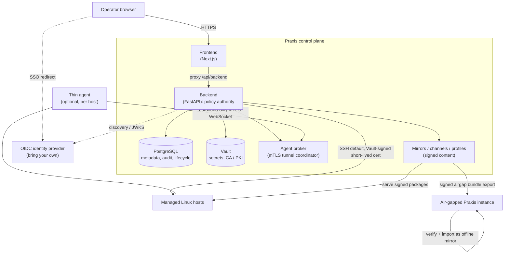

This document describes how Praxis is structured for security: the tiers, where
trust boundaries sit, what each component is allowed to do, and how host access
and content stay verifiable. It is a companion to
[Fleet Lifecycle Architecture](fleet-lifecycle-architecture.md) and
[Agent Protocol](agent-protocol.md).

## Architecture at a glance

If the diagram does not render, the same shape in prose:

- The **operator browser** talks only to the **frontend**, which proxies API
  calls to the **backend**.
- The **backend** is the only component that talks to the data tier
  (**PostgreSQL** and **Vault**), to the **agent broker**, and to the **mirror**
  subsystem. It is the single policy authority.
- **Managed hosts** are reached over **SSH by default** (with short-lived
  Vault-signed certificates) or, optionally per host, via a **thin agent** that
  dials **out** to the broker over mTLS.
- **Mirrors** serve signed package content to hosts, and can export a **signed
  airgap bundle** that a disconnected Praxis instance verifies and imports.
- SSO uses a **bring-your-own OIDC provider**; the browser is redirected to it,
  and the backend validates tokens against the provider's discovery/JWKS.

## Tiers and network separation

Praxis runs as three tiers with a deliberately narrow path between them:

- **Presentation tier**: the browser and the Next.js frontend. The frontend
  serves the UI and proxies `/api/backend/...` to the backend. It holds no
  secrets and makes no host connections.
- **Application tier**: the FastAPI backend. It authenticates and authorizes
  every request, owns all policy and orchestration, and is the only tier with a
  route to the data tier.
- **Data tier**: PostgreSQL and Vault. They have no route back to the browser;
  the backend is the sole ingress.

The bundled deployment enforces this with a two-network model: a frontend
network joins the browser-facing frontend to the backend, and a separate backend
network joins the backend to PostgreSQL and Vault. The database and Vault are not
reachable from the frontend network.

## What each component is trusted to do

- **Backend: the policy authority.** Authentication, authorization (fleet-scoped
  RBAC), approvals, audit, inventory, credential brokering, SSH/agent transport
  selection, package/patch/compliance/remediation logic, and content promotion
  all live here. Nothing downstream is trusted to make policy decisions.
- **PostgreSQL: system of record.** Stores application metadata, fleet and
  lifecycle records, and the audit event log. It does not store raw secret
  material.
- **Vault: secret and PKI custody.** Stores credential material and the SSH
  certificate-authority / PKI state used to mint short-lived host certificates.
  The backend requests secrets and signatures from Vault; secrets do not live in
  the application database.
- **Agent broker.** Coordinates the mTLS tunnels that optional thin agents dial
  out to, and routes transport-neutral host operations to the right agent. It
  carries operations; it does not decide policy.
- **Thin agent (optional, per host).** Exposes local **primitives only**: exec,
  file operations, facts, heartbeat, and a PTY primitive over an
  **outbound-only** mTLS WebSocket. It holds no policy. Because agents expose
  primitives rather than policy, they rarely need updating and the backend stays
  the authority.
- **Mirrors, channels, content profiles.** The content trust chain: mirrored
  repositories are signed, channels and profiles are control-plane primitives
  that decide what a host is allowed to install, and hosts verify signatures
  before installing.

## Bundled secrets service: service credentials vs. recovery material

The bundled deployment ships an **OpenBao** container (a Vault-compatible secrets
service; the Docker service, volumes, and paths keep the `vault` names for
compatibility) for convenience. Its on-disk material is split into two volumes so
application services never hold operator recovery material:

- **Runtime volume (`vault_data`, mounted read-only into backend + agent-broker).**
  Holds only what the app needs: the **scoped** backend service token
  (`backend-token`, limited to the KV/SSH/agent/broker paths its policy grants)
  and **public** material: the SSH CA public key, the agent CA certificate, and
  the broker TLS files. No root token or unseal keys live here.
- **Recovery volume (`vault_recovery`, mounted ONLY into the Vault container).**
  Holds the operator recovery material: the unseal keys and initial root token
  (`init-keys.json`, `root-token`), written with restrictive permissions. Backend
  and agent-broker do not mount this volume, so they cannot read it. Upgrading an
  older stack automatically migrates any legacy `root-token` / `init-keys.json`
  out of `vault_data` into this volume on the next Vault start.

Operators retrieve recovery material only from inside the Vault container, e.g.
`docker compose exec vault cat /vault/recovery/root-token`. Back up the
`vault_recovery` volume out-of-band; losing it means losing the ability to
unseal.

**Why the bundled secrets service still keeps a root token:** the init script
re-ensures the KV/SSH/agent/broker PKI wiring on every start (so upgrades pick up
new mounts), which needs a privileged token. That token is confined to the
operator-only recovery volume rather than revoked, which is the accepted 1.0
bundled-mode trade-off. **For production, run an external OpenBao/Vault-compatible
service (or the bundled OpenBao with auto-unseal via a cloud KMS/HSM transit key)**
so no long-lived root token is stored on disk and unsealing is automated; point the
backend at it with `VAULT_ADDR` + a scoped `VAULT_TOKEN` and leave
`vault_data`/`vault_recovery`
unused.

## Host access and identity

- **SSH is the default transport.** The backend connects to managed hosts with
  short-lived, Vault-signed user certificates whose principal is the fleet-role
  resolved login, so the remote shell runs as the authorized Unix user and every
  session is attributable to a Praxis identity.
- **The optional agent transport is outbound-only mTLS.** A host never needs an
  inbound listener for Praxis; the agent dials the broker.
- **Interactive browser terminal sessions always use SSH in 1.0**, even when a
  host's transport preference is `agent`. The agent's PTY primitive is not wired
  to browser sessions because the agent runs as root with no per-user identity
  switching, while an SSH certificate carries the operator's Unix principal. See
  [Agent Protocol](agent-protocol.md) for the full rationale.
- **Credentials are short-lived by preference.** Signed certificates with
  role-scoped TTLs are preferred over long-lived host secrets.
- **No standing user-facing privileged escalation (1.0 baseline).** Praxis 1.0
  issues no root shell, no password-sudo path, no break-glass root profile, no
  raw sudoers authoring, and no fleet/group/system sudo inheritance. Fleet-role
  user accounts (including the built-in `admin` and `maintainer`) are provisioned
  with **no sudoers drop-in and no privileged OS group** (`wheel`/`sudo`). The
  fleet-role API rejects raw sudoers snippets and privileged group requests.
  Privileged host work is performed only by **named, non-interactive Praxis
  automation** (patching, package jobs, host reconciliation) escalating through a
  dedicated automation credential's sudo method, scoped to the workflow, audited,
  and not reusable as an arbitrary root shell. Interactive root is **out-of-band**
  under your ops runbook, not a Praxis-issued grant.

## Identity and authorization

- **Authentication** is via a bring-your-own OIDC provider (primary) or local
  accounts, with optional TOTP step-up for privileged fleet roles. See
  [OIDC / SSO Setup](oidc-setup.md).
- **Authorization** is fleet-scoped RBAC: bindings map a user or app-role to a
  fleet role scoped to a group, and each fleet role carries an explicit set of
  allowed actions. Just-in-time access requests are approved by a different
  operator than the requester.
- **Revocation is synchronous at the boundary, then reconciled.** Removing access
  (binding delete or disable, JIT revoke or expiry, role removal, deactivation,
  access-review revoke, or an emergency lock) denies new authorization
  synchronously (grant state is the authority), closes reachable sessions, and
  queues host cleanup through one common, retried, operator-visible path. Offline
  hosts stay visibly pending, and an already-issued cert has a bounded one-hour
  residual with no offline-revocation guarantee. See
  [Access revocation (1.0 SLA)](access-revocation.md).

## Content and airgap trust

- Mirrored repositories are **signed**, and hosts verify signatures before
  installing.
- **Airgap bundles** are exported as **signed** archives from a connected
  instance; the disconnected instance verifies the bundle before importing it as
  an offline mirror that does not sync upstream. See
  [Airgap export / import](airgap.md).

## Audit and approvals as control-plane records

Access grants, sessions, command execution, file transfer, certificate
lifecycle, content promotion, patch plans, and remediation actions emit stable
audit events regardless of transport. Approvals (access requests, command
approvals, remediation approvals) are recorded transitions, not side effects.
See [Audit Event Schema](audit-schema.md) and
[Compliance Evidence Map](compliance-map.md).

## Boundaries and operator responsibilities

Some security properties are the operator's responsibility, not Praxis'. These
are covered in [Known Limitations](known-limitations.md), notably
encryption-at-rest for the data tier, audit retention windows, and the fact that
Praxis produces compliance *evidence*, not a compliance attestation.
